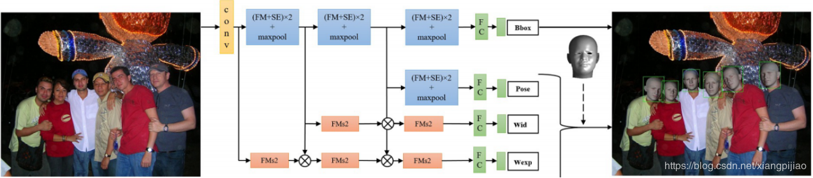

# Joint Face Detection and Facial Motion Retargeting for Multiple Faces
---
##采用senet学习特征的权重（参考1.1.1）

##首先是人脸的表示
+  $V \times b_{id} \times b_{exp}$
   最原始的$V$属于11510 × 3， $b_{id}$和$b_{exp}$范围是50, 47,但是为了减少数据量,我们把$V \times b_{id} \times b_{exp}  \in 11510 \times 50 \times 47$减少到了204变成$204 \times 50 \times 47$,其他不变.
+ 完整公式
   $P_{lm} = \begin{bmatrix}
        f & 0 & 0 \\
        0 & f & 0
        \end{bmatrix}
        [R * (\hat{M} * w_{id} * w_{exp}) + t] 
   $
   前面矩阵就是为了把3D图像转换成2d坐标,$w_{id}$ 身份权重,$w_{exp} $表达权重, $R$旋转参数 $t$ 偏移参数.
   学习 $w_{id} \quad w_{exp}  \quad R \quad P_{lm}$ ,前三个的L1, 后面一个的L2 loss

