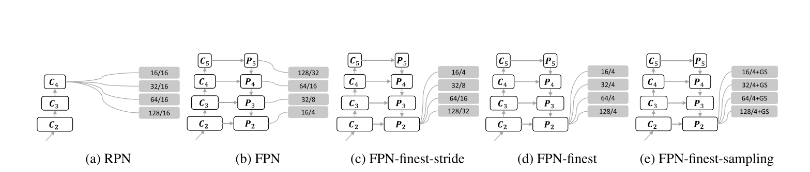
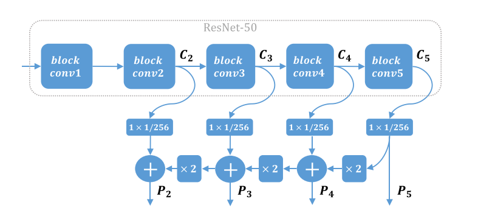

# Group Sampling for Scale Invariant Face Detection Xiang
## Thought
+ Faster R-CNN tend to miss faces at small scale beacuse of the large stride size of the anchor.
+ To balance the negetive sample and positive sample, when training, we randomly sample 1:3 postitive sample and negetive sample.

  Only use the last layer! use group sampling, forword second point.

##Groud Sampling Method
###1、Anchor Matching Strategy
+ $\{p_i\}^n_{i=0}$ where $i$ is the index of the anchor and n is the number of the anchors for all scales.And $\{g_j\}^m_{j=0}$ is the ground truth.
+ $M(i, j) \in R^{n \times m}$ 
+ $M(i, j) = IoU(p_i, j_i)$.
+ $C(i) = \mathop{max}\limits_{1 \le j \le m}M(i, j)$
+ $L(i) = \begin{cases}
1 & \lambda_1 \le C(i)\\
-1 & \lambda_2 \le C(i) < \lambda_1\\
0 & C(i) < \lambda_2
\end{cases}$
+ L(i) is the label, 1 is the postive tag and 0 is the negetive tag, but -1 we discard beacuse it may be uselss
+ For some ground ture say $g_j$ ,we did't used, we match it with $p_i$ satisfied three condition.
  * this anchor is not match any other ground-true boxed
  * $IoU(p_i, g_j) \ge \lambda_3$
  * $j = \mathop{argmax}\limits_{1 \le u \le m}IoU(p_i, g_u)$
+ There are two imbalance
   * Positive and negative samples are not balanced, and negetive samples is greater.
   * Samples at different scales are not balanced, small objects are more difficult to find.
+ We do two part to solve this imbalances
   * each train group with the same sale and number of tiran samples
   * we randomly sample 1:3 postive samples to negetive samples

##Loss Function
+ $L_{reg} = \frac{1}{N_{reg}}\sum\limits_{(p_i, g_j)}||1 - IoU(p_i, g_j)||_2^2 $

##Exeperience
+ WIDER FACE
+ learning_rate_0.1 by 60 epoch dan decay set to 0.9, and $5 \times 10^{-5}$ respectively
+ each image will be resized by $0.25 \times n$ which $ n \in [1, 8]$
+ set $\lambda_1 = 0.6$ and $\lambda_2 = 0.4$