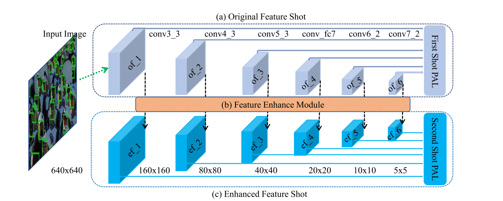
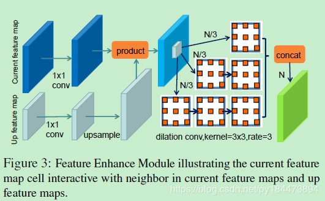

# Dual Shot Face Detector
## Preview
+ A novel Feature Enhance Module to utilize different level information and thus obtain more discriminability and robustness features. 
+ Auxiliary supervisions introduced in early layers via aset of smaller anchors to effectively facilitate the features. 
+ An improved anchor matching strategy to match an-
chors and ground truth faces as far as possible to provide better initialization for the regressor. 
+ Comprehensive experiments conducted on popular benchmarks FDDB and WIDER FACE to demonstrate the superiority of our proposed DSFD network compared with the state-of-the-art methods.



## FEM(Feature Enchance Model)

```
class FEM(nn.Module):
    def __init__(self, channel_size):
        super(FEM , self).__init__()
        self.cs = channel_size
        self.cpm1 = nn.Conv2d( self.cs, 256, kernel_size=3, dilation=1, stride=1, padding=1)
        self.cpm2 = nn.Conv2d( self.cs, 256, kernel_size=3, dilation=2, stride=1, padding=2)
        self.cpm3 = nn.Conv2d( 256, 128, kernel_size=3, dilation=1, stride=1, padding=1)
        self.cpm4 = nn.Conv2d( 256, 128, kernel_size=3, dilation=2, stride=1, padding=2)
        self.cpm5 = nn.Conv2d( 128, 128, kernel_size=3, dilation=1, stride=1, padding=1)
    def forward(self, x):
        x1_1 = F.relu(self.cpm1(x), inplace=True)
        x1_2 = F.relu(self.cpm2(x), inplace=True)
        x2_1 = F.relu(self.cpm3(x1_2), inplace=True)
        x2_2 = F.relu(self.cpm4(x1_2), inplace=True)
        x3_1 = F.relu(self.cpm5(x2_2), inplace=True)
        return torch.cat([x1_1, x2_1, x3_1] , 1)
```
FEM class just to the last part of the FEM illustration
<!-- The Up Feature Map is using original image convoluted by 2 times of stride. -->
And the original and the enhanced have two different losses respectively named First Shot progressive anchor Loss (FSL) and Second Shot progressive anchor Loss (SSL).

