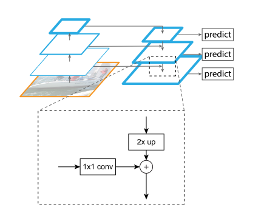

#Feature Pyramid Networks for Object Detection
## Thought
+ Mutiple scale feature is more robust than high-resolution feature.
+ The same as U-Net.

+ We output the feature right, exclude the first right, beacuse of its large memory footprint.
+ $1 \times 1$ convolutional layer is used to decrease dimentions.