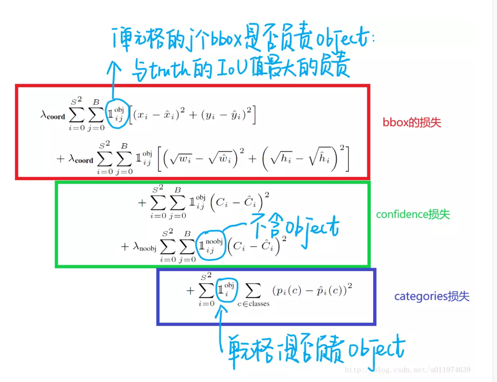

# yolo
##Tough
- output
  + Split the origin image into $S \times S$ where $S=7$ generally. 
  + Eeach anchor predict $B \times (4 + 1)$, where 4 means position and 1 is confidence scores.
  + $C$ is kinds number of objects we want to predict.
  + So the final output is $7 \times 7 \times (2 \times  5 + 20)$
- offset
  + origin position is $(x_{col}, y_{row}, w, h)$
  + we train $x = \frac{x_c}{w_i}S - x_{col}$ is the Proportion of $w_i$ ($w_i$ is the width of origin image)
  + we trian $y = \frac{y_c}{h_i}S - y_{row}$ is the Proportion of $h_i$ ($h_i$ is the height of origin image)
  + Similarly $w = \frac{w_b}{w_i}$, $h = \frac{h_b}{h_i}$
  + confidence is $Pr(Object) * IOU_{pred}^{truth}$
  + $Pr(Class_i) = Pr(Class_i|Object) * Pr(Object)$

##Problem
+ 8dimention localization error and 20 classifcation error obviously don't balance
+ if an anchors has no objects, it's confidence is 0,it may overpowering as less anchors with object
