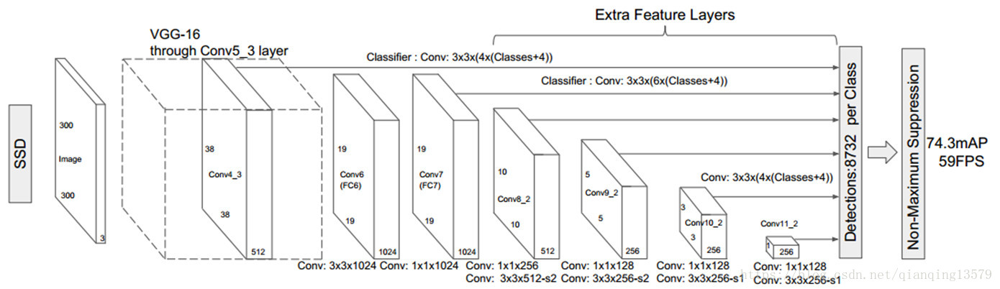
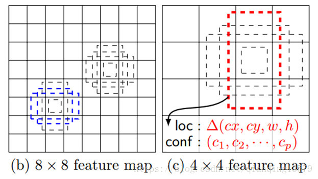
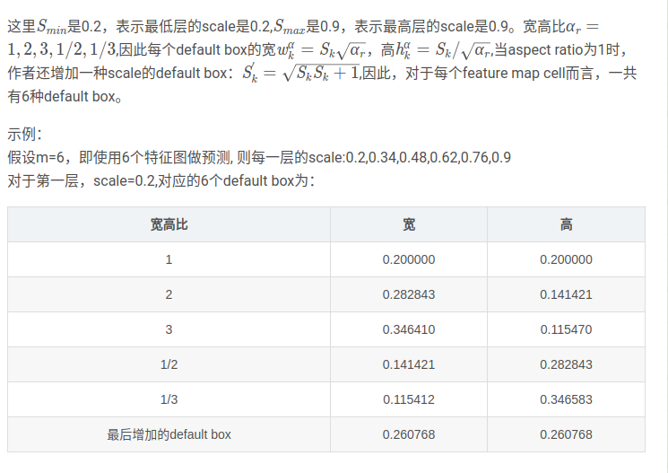
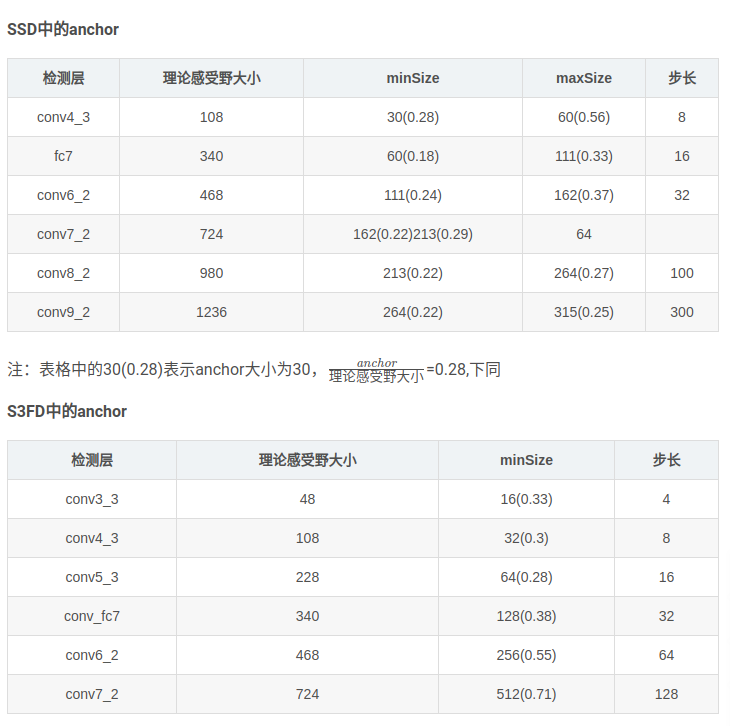

# ssd
# Thought
+ 使用多尺度

+ 设置了多种宽高比
    {1,2,3,1/2,1/3}

    SSD300中default box的数量:（38384 + 19196 + 10106 + 556 + 334 + 114）= 8732
+ 理论感受野和有效感受野
    影响某个神经元输出的输入区域就是理论感受野，但是很多时候只有中间的影响最大，那一小部分就是有效感受野。
+ 为什么要设置default box
    因为特征图上的每一个点对应一个理论感受野，ssd相当于对原图中所有的理论感受野作了分类和回归。

SSD本质上就是对所有滑动窗口进行分类和回归。
    如何选择default box的scale和aspect ratio。
    $S_k = S_{min} + \frac{S_{max} - S_{min}}{m-1}(k-1)$
    相当于平均取尺度
    m=6代表用6个特征图做预测

+ SSD数据增强
    - 放大操作  随机crop，patch与任意一个目标的IOU为0.1,0.3,0.5,0.7,0.9，每个patch的大小为原图大小的[0.1,1],宽高比在1/2到2之间。能够生成更多的尺度较大的目标
    - 缩小操作 首先创建16倍原图大小的画布，然后将原图放置其中，然后随机crop，能够生成更多尺度较小的目标

SSD缺点
+ 对小目标的检测效果一般
    - 增大输入尺寸
    - 使用更低的特征图做检测
    - 设置default box的大小。
+ 关于anchor的设置和优化
    - 使用聚类的方式初始哈anchor

SSD中的Mining机制
+ 类别不均衡（将sample按照当前Loss排序， 选出loss最大的N个，其余的抛弃。）

一般 $\frac{anchor}{理论感受野大小} $的范围为[0.2, 0.5]之间，补偿一般设置为anchor大小的1/4,一般选择第三个pooling的前一个卷积层为检测层，如果16是第一个检测层，后面每一个添加一个检测层，anchor大小的步长为前一层的2倍。