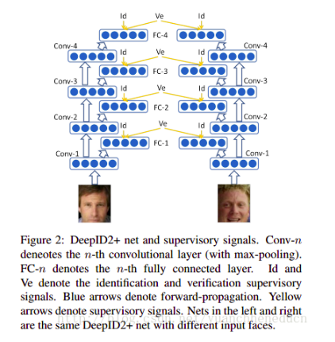
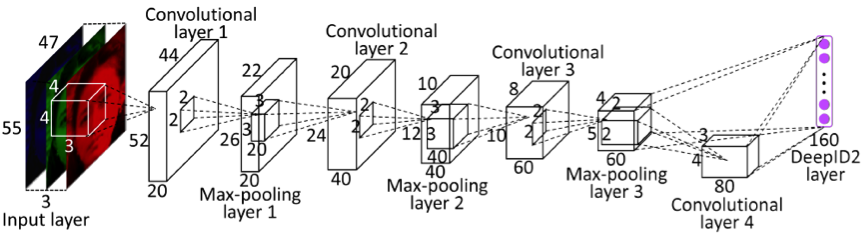
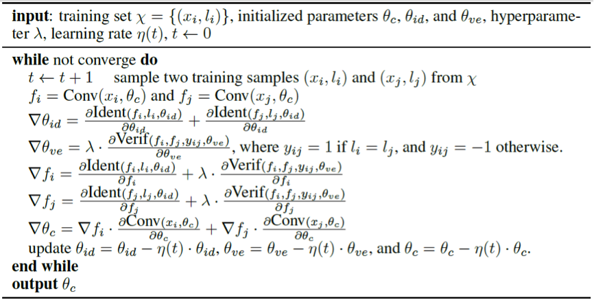

---

$f=Conv(x, \theta_c)$

$Ident(f, t, \theta_{id}) = - \sum\limits_{i=0}^n-p_ilog\hat{p}_i=-log\hat{p}_t$

$Verif(f_i, f_j, y_{ij}, \theta_{ve}) = 
\begin{cases}
    \frac{1}{2}||f_i - f_j||^2_2 & if\text{ } y_{ij} = 1 \\
    \frac{1}{2}max(0, m - ||f_i - f_j||_2)^2 & if \text{ } y_{ij} = -1 \\
\end{cases}$

意思是如果不同的话$f_i \text{和}f_j$距离要大于m，但是不是越大越好，这样不同人脸之间才有识别。