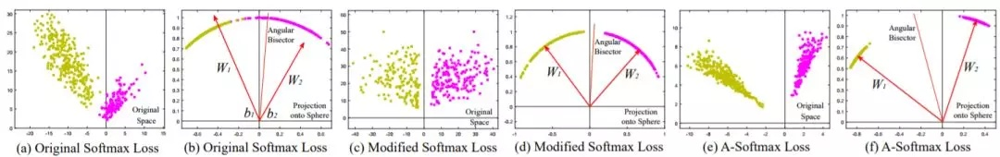
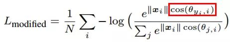
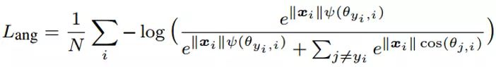
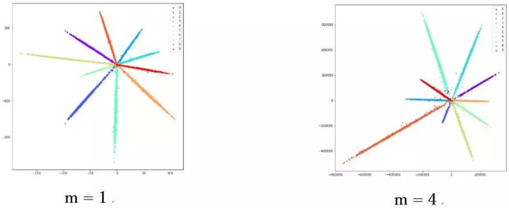
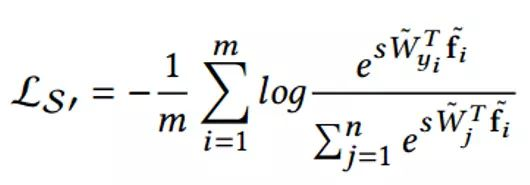
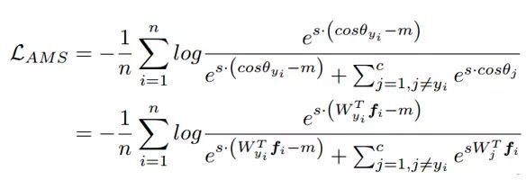

$cos$目的是为了使得分类之后yi类的cos尽可能的大，cos值域是[-1, 1]。

$\psi(\theta_{y}, i) \text{ is }$  之所以在原文中变得复杂，只是为了将定义域扩展到 [0,2π] 上，并保证在定义域内单调递减。m越大，惩罚系数越大。m>=3就能保证最大类内距离小于最小类外距离。

虽然说优化了cos，但实际上只需要优化角度就可以了，不需要它的模长，如下图

所以我们开始时候要把特征归一化

