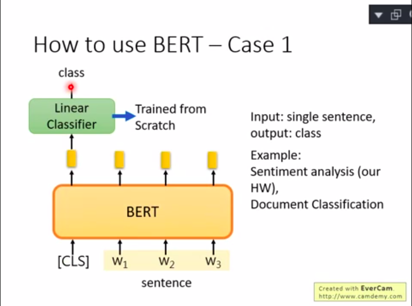
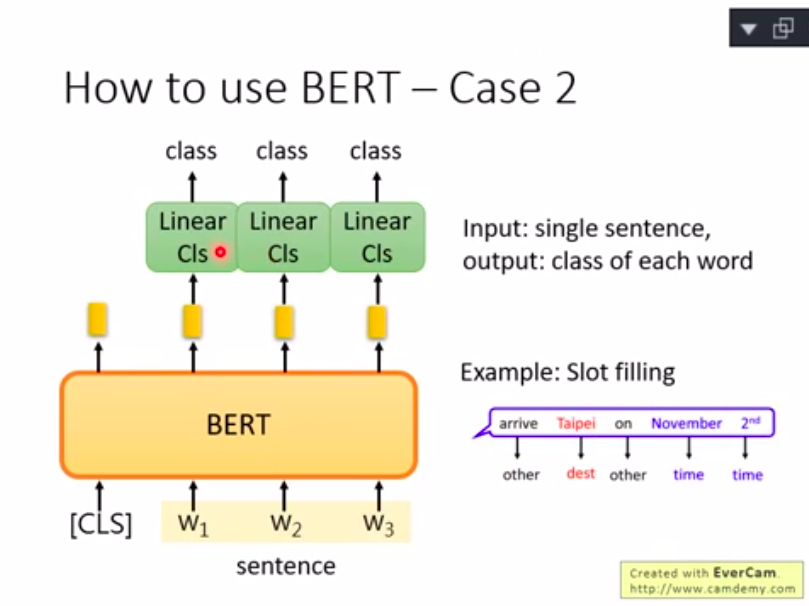
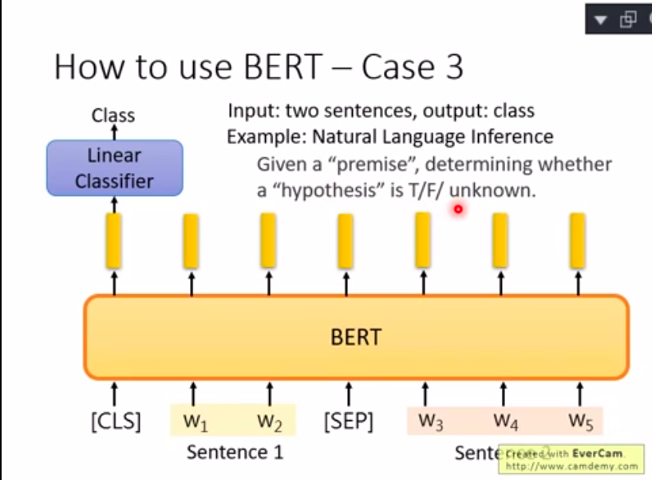

做word embedding

Method of trianing
1. 输入漏掉一个词的句子，然后生成特征，用一个弱分类器分到那个缺掉的词，这样特征就会很好。
2. 放两段话，bert来判断是不是一个句子。

ERNIE(Enhanced Rrepresentation through Knowledge Integration)
本来Bert是盖住一个character，现在ERINE是盖住一个word

GPT(Generative Pre-Training)

---
