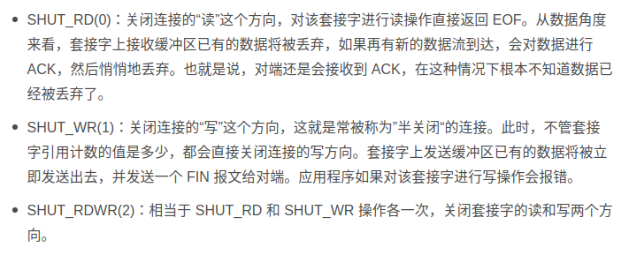

# TIME_WAIT

+ 主机1 为了帮助主机2关机， 所以会进入一个TIME_WAIT状态， TIME_WAIT会持续固定时间，占用端口，linux有个字段TCP_TIMEWAIT_LEN = 60s，会停留60秒。
```c
#define TCP_TIMEWAIT_LEN (60*HZ) /* how long to wait to destroy TIME-        WAIT state, about 60 seconds	*/
```

+ 原理是假设有些包在网络中传递，但是连接已经关闭，如果建立了新的连接会认为是新连接的一部分，所以设定这个时间是为了使得所有在网络中的tcp包失效。
+ 只有发起连接终止的一方会进入 TIME_WAIT 状态

## 解决方法
+ 用sysctl命令，将系统值调小（net.ipv4.tcp_max_tw_buckets）
+ 调低TCP_TIMEWAIT_LEN, 缺点是要重新编译系统。
+ SO_LINGER的设置，linger的意思是停留。
    ``` c
    int setsockopt(int sockfd, int level, int optname, const void *optval,socklen_t optlen);
    ```
    ```c
    struct linger {
    　int　 l_onoff;　　　　/* 0=off, nonzero=on */
    　int　 l_linger;　　　　/* linger time, POSIX specifies units as seconds */
    }
    ```
    如果l_onoff为0，则关闭选项，l_linger的值被忽略，close或shutdown会立即返回，如果有数据残留，将会试图发送出去。

    如果l_onoff不为0， 而l_linger为0，调用close后会立即发送一个RST标志给对面，跳过四次挥手，直接关闭，这个是强行关闭，残留数据不会发送，关闭方也不不知道彻底断开，只能被动关闭方阻塞在recv()上时候，接收到RST有个"connet reset by peer"异常

    如果两个非-，调用close后会阻塞发送完出去或者l_linger时间到。
+ 更安全的net.ipv4.tcp_tw_reuse选项，解释是Allow to reuse TIME-WAIT sockets for new connections when it is safe from protocol viewpoint. Default value is 0.It should not be changed without advice/request of technical experts.
可以复用TIME_WAIT套接字为新的连接所用。主要有两点
   - 只适用于发起连接方。
   - 对应的TIME_WAIT只有连接创建1秒后才能用。
   - 
使用这个选项，还有一个前提，需要打开对 TCP 时间戳的支持即net.ipv4.tcp_timestamps=1（默认1）