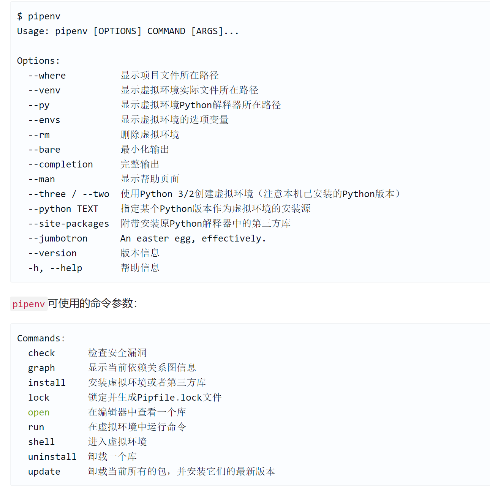

最佳实践因素
12factor.net
+ pipenv
    - pip install pipenv
    - 进入project环境之后 pipenv --python 3.7
    - 环境中Pipfile定义了安装的源 和各种的包
    - pipenv graph查看各种包依赖关系
    - pipenv request --skip-lock 跳过lock
    - pipenv shell 可以进入虚拟环境 exit 退出
    - pipenv install --dev pytest --skip-lock 安装在开发环境中
    - pipenv --venv 查看虚拟环境位置
    - pipenv --where 查看位置
    - pipenv check 查看漏洞
    - pipenv --py 重新安装包
    - pipenv --rm 删除环境
    ```
    pipenv run python manage.py runserver 0.0.0.0:8080 #在虚拟环境中运行
    ```


+ 自定义用户表
    - 继承AbstractUser
    - 指定用户名可以在class Meta中指定username_field = '字段名'
    - 哪些字段必填可以在class Meta中指定require_fields = ['', '']

+ 优先使用通用类视图(Class-based Generic Views)
   ```python
   from django.views.generic import View # 类视图
   ```
   ccbv.co.uk django通用类视图学习网站

+ 在系统环境变量中保存敏感信息
    ```
    pipenv install django-environ --skip-lock
    ```

+ 为不同环境分别配置settings.py

+ 一定要编写测试用例
```
pipenv install coverage --skip-lock # 测试代码覆盖率
pipenv run coverage run manage.py test -v 2
pipenv run coverage html
```