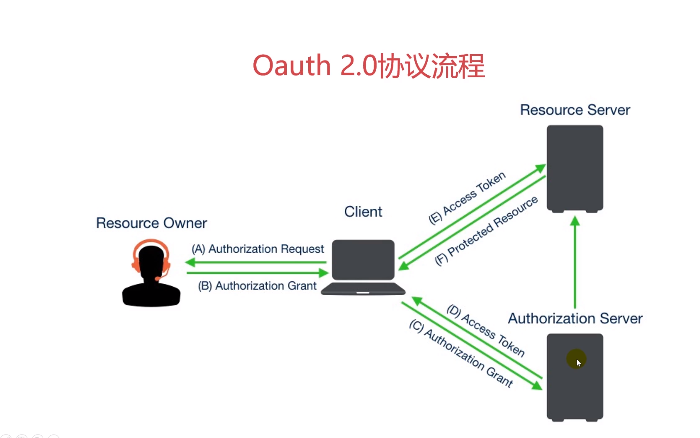
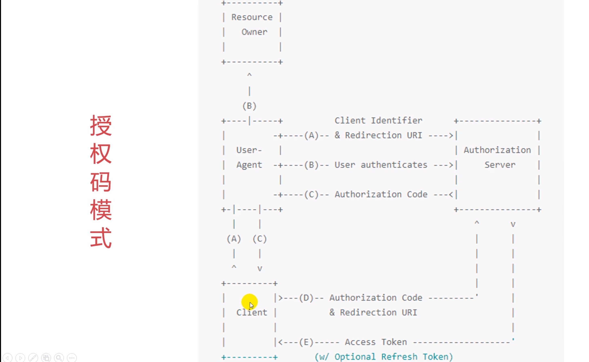

```python
# 提高兼容性，使得python2 能够编译unicode编码
from django.utils.encoding import python_2_unicode_compatible
@python_2_unicode_compatible
class User(AbstractUser):

    # First Name and Last Name do not cover name patterns
    # around the globe.
    nickname = models.CharField(null=True, blank=True, max_length=255, verbose_name="昵称")
    job_title = models.CharField(max_length=50, null=True, verbose_name="职称")
    introduction = models.TextField(blank=True, null=True, verbose_name="简介")
    picture = models.ImageField(upload_to='profile_pics/', null=True, blank=True, verbose_name="城市")
    location = models.CharField(max_length=50, null=True, blank=True, verbose_name="城市")
    personal_url = models.URLField(max_length=255, null=True, blank=True, verbose_name="个人链接")
    weibo = models.URLField(max_length=255, null=True, blank=True, verbose_name="微博链接")
    github = models.URLField(max_length=255, null=True, blank=True, verbose_name="知乎链接")
    linkedin = models.URLField(max_length=255, null=True, blank=True, verbose_name="LinkedIn链接")
    created_at = models.DateTimeField(auto_now_add=True, verbose_name="创建时间")
    updated_at = models.DateTimeField(auto_now=True, verbose_name="更新时间")

    class Meta:
        verbose_name = '用户'
        verbose_name_plural = verbose_name

    def __str__(self):
        return self.username

    def get_absolute_url(self):
        # 返回用户详情页路径
        return reverse("users:detail", kwargs={"username": self.username})

    def get_profile_name(self):
        if self.nickname:
            return self.nickname
        return self.username

```

+ django-allauth 用户登录模块 
    https://django-allauth.readthedocs.io/en/latest/
    使用说明
    配置ACCOUNT_AUTHENTICATION_METHOD = 'username' # email/username 配置允许用什么登录
    配置ACCOUNT_EMAIL_VERIFICATION = 'mandatory' #强制邮箱验证， 也可以"none" 或者 "optional"

    - 集成github登录 INSTALLED_APPS里面配置 'allauth.socialaccount.providers.github'
    - github开发者选项中获取两个id
    - 在数据库oscialaccount_socialapp和oscialaccount_socialapp_sites中添加两个id

+ OAuth 2.0协议的原理
    
    

+ 接下里修改view，用户详情页面
  ```
  class UserDetailView(LoginRequiredMixin, DetailView):

    model = User
    template_name = 'users/user_detail.html'
    slug_field = "username"
    slug_url_kwarg = "username"

  ```

+ 修改个人信息页面
  ```
  class UserUpdateView(LoginRequiredMixin, UpdateView):

    model = User
    # 允许修改的字段
    fields = ['nickname', 'email', 'picture', 'introduction', 'job_title', 'location',
              'personal_url', 'weibo', 'zhihu', 'github', 'linkedin']
    template_name = 'users/user_form.html'

    def get_success_url(self):
        return reverse("users:detail", kwargs={"username": self.request.user.username})

    def get_object(self, queryset=None):
        # return User.objects.get(username=self.request.user.username)
        return self.request.user

    def form_valid(self, form):
        messages.add_message(
            self.request, messages.INFO, _("Infos successfully updated")
        )
        return super().form_valid(form)
  ```

+ 在总路由中加入
``` python
path('users/', include('users.urls'), namespace='users'),
```

+ 在用户urls中
``` python
from django.urls import path
from lmbtough.users import views
app_name = "users"
urlpatterns = [
    path("update/", views.UserDetailView.as_view(), name="update"),
    # 之前定义的slug_url_kwarg = "username"
    path("<str:username>/", views.UserDetailView.as_view(), name="detail"),
]

```

+ {{block.super}}继承上一个模板中东西

+ thumbnail 处理图片

+ {{form.as_p}} 不如 {{form | crispy}}好看。

+ 编写测试用例
   - 删掉不要的，只保留 test_models.py test_urls.py test_views.py 不用pytest删除conftest.py
   - 使用django-test-plus
    test_models.py
``` python
import pytest
from django.conf import settings

from test_plus.test import TestCase


class TestUser(TestCase):

    def setUp(self):
        self.user = self.make_user()

    def test__str__(self):
        self.assertEqual(self.user.__str__(), 'testuser')

    def test_get_absolute_url(self):
        self.assertEqual(self.user.get_absolute_url(), '/users/testuser/')

    def test_get_profile_name(self):
        assert self.user.get_profile_name() == 'testuser'
        self.user.nickname = '昵称'
        assert self.user.get_profile_name() == '昵称'
```
test_urls.py
``` python
from test_plus.test import TestCase
from django.urls import resolve, reverse


class TestUserURLs(TestCase):

    def setUp(self):
        self.user = self.make_user()

    def test_detail_reverse(self):
        self.assertEqual(reverse('users:detail', kwargs={'username': 'testuser'}), '/users/testuser/')

    def test_detail_resolve(self):
        self.assertEqual(resolve('/users/testuser/').view_name, 'users:detail')

    def test_update_reverse(self):
        self.assertEqual(reverse('users:update'), '/users/update/')

    def test_update_resolve(self):
        self.assertEqual(resolve('/users/update/').view_name, 'users:update')

```
test_views.py
``` python
#!/usr/bin/python3
# -*- coding:utf-8 -*-
# __author__ = '__Jack__'

from django.test import RequestFactory
from test_plus.test import TestCase

from lmbtough.users.views import UserUpdateView


class BaseUserTestCase(TestCase):

    def setUp(self):
        self.factory = RequestFactory()
        self.user = self.make_user()


class TestUserUpdateView(BaseUserTestCase):

    def setUp(self):
        super(TestUserUpdateView, self).setUp()
        self.view = UserUpdateView()
        request = self.factory.get('/fake-url')
        request.user = self.user
        self.view.request = request

    def test_get_success_url(self):
        self.assertEqual(self.view.get_success_url(), '/users/testuser/')

    def test_get_object(self):
        """get_object()函数中request请求的用户"""
        self.assertEqual(self.view.get_object(), self.user)

```

``` python
# 构建虚拟request， 以便测试视图时候不经过wsgi等部分
self.view = UserUpdateView()
request = self.factory.get('/fake-url')
request.user = self.user
self.view.request = request
```