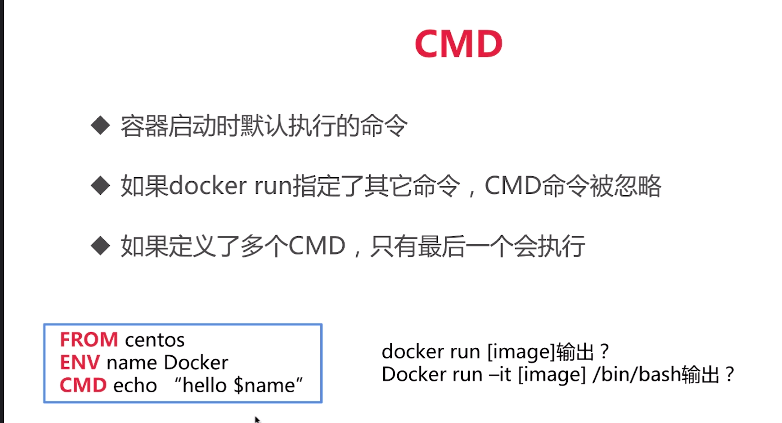

sudo docker image ls 查看本地img  
sudo docker images  
sudo docker pull ubuntu:14.04 从库中拉下来img（docker hub）

---
让当前用户能够有使用docker的权限  
sudo groupadd docker  
sudo gpasswd -a 用户名 docker  
sudo service docker restart  

---
编写最简单image
sudo yum install gcc  
sudo yum install glibc-static  

编译 gcc -static hello.c -o hello  
编写一个 Dockerfile  
``` 
FROM scratch
ADD hello /
CMD ["/hello"]
```
docker build -t zzy/hello-world .  
docker history ID能查看img  
docker run zzy/hello-world  

---
docker container  

docker container ls -a列出所有容器  
docker run -it centos 交互式运行centos  
docker container ls -aq q列出所有的id  
和docke container ls -a | awk {'print$1'}一样  
docker rm $(docker container ls -aq)  
docker container ls -f "status=exited"

---
docker container commit  
docker image build


1. docker run -it centos  
2. 执行完安装操作后docker commit 加上查出来container的name加上你自己取的img name

但是通过docker container commit 创建的img发布可能会不安全，因为看不到里面细节。  
所以要通过docker image build去创建

先创建一个文件夹 docker-centos-vim  
创建 Dockerfile
```
FROM centos
RUN yum install -y vim
```
docker build -t tag_name .

---
## docker image语法
FROM scratch #制作base image  
FROM centos #使用base image  
FROM ubuntu:14.04  
最佳实践：尽量用官方的

LABEL maintainer="temp@gmail.com"  
LABEL version="1.0"  
LABE description="This is description"  
最佳实践：注释必不可少

RUN yum && yum install -y vim \  
           python-dev  
RUN apt-get update && apt-get install -y perl \  
    pwgen --no-install-recomments && rm -rf \  
    /var/lib/apt/lists/*  
最佳实践：每一个RUN都生成一层， 用 / 隔开

WORKDIR /root #相当与CD  
WORKDIR /test  
WORKDIR demo  
RUN pwd # 结果是/test/demo  
最佳实践：尽量使用绝对目录


ENV MYSQL_VERSION 5.6 # 设置常量  
最佳实践： 尽量多使用ENV  

可以在docker doc里面查 

---
RUN 执行命令并创建新的Image Layer  
CMD 设置容器启动后默认执行的命令和参数  
ENTRYPOINT 设置容器启动时运行的命令  

两种格式
### Shell格式
RUN ap-get install -y vim  
CMD echo "hello docker"  
ENTRYPOINT echo "hello docker"  

### Exec格式
RUN ["apt-get", "install", "-y", "vim"]  
CMD ["/bin/echo"] 

```
FROM centos
ENV name Docker
ENTRPOINT ["/bin/echo", "hello $name"] #这个是不能把name的值打印出来
要ENTRPOINT ["/bin/bash", "-c", "echo hello $name"]
```




---

docker login
docker push + tag可以上传

registry 搭建一个内网的docker hub
然后之后build时候 docker build -t 10.75.44.222:5000/hello-world .  

在此之前要在 /etc/docker/key.json中加入  
{"insecure-registries":["10.755.44.222:5000"]}  
中加入 vim /lib/systemd/system/docker.service  
EnvironmentFile=/etc/docker/daemon.json  
sudo service docker resstart  

docker push 10.75.44.222:5000/hello-world  
可以查 docker registry api  查看接口


---
实际部署

mkdir flask-hello-world

sudo vim Dockerfile

```
FROM python:2.7
LABEL "your note"
RUN pip install flask
COPY app.py /app
WORKDIR /app/
EXPOSE 5000
CMD ["python", "app.py"]
```
sudo vim app.py

docker run -d tagname 后台运行

---
## 对容器的使用  
docker exec -it id串 /bin/bash

docker inspect id串 显示详细信息

---
## 另一个实践
docker run -it ubuntu  
apt-get update && apt-get install -y stress  

stress --vm 1 --verbose 默认创建再释放再创建  
stress -v m 1 --vm-bytes 50000M --verbose 不能分配这么多

```
FROM ubuntu
RUN apt-get update && apt-get install -y stress
ENTRYPOINT ["/usr/bin/stress"]
CMD []
```
这样run的时候 就可以 docker run -it tagname --vm 1 --verbose 后面带参数运行

docker run --memory=200M --cpu-shares=10 --name=test1 tagname