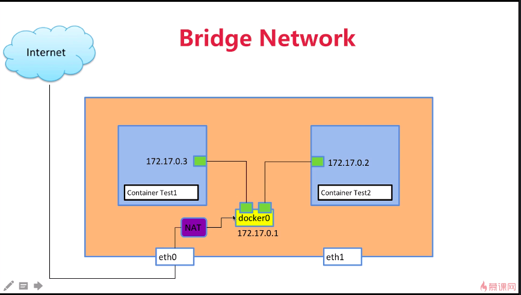

1. sudo docker run -d --name test1 busybox /bin/sh -c "while true;do sleep 3600;done"
2. sudo docker exec -it id /bin/sh
   

3. sudo ip netns list 查看网络namespace
4. sudo ip netns add test1
5. sudo ip netns exec test ip link查看ip链接
6. sudo ip netns exec test ip link set dev  lo up 让lo端口打开
7. sudo ip link add veth-test1 type veth peer name veth-test2 创建link
8. sudo ip link set veth-test1 netns test 添加veth-test1到netns中去
9. sudo ip netns exec test1 ip addr add 192.168.1.1/24 dev veth-test1额 添加ip
10. 然后启动几个端口
11. 然后两个netns之间就可以ping通

---
docker network ls 查看docker网络  
+ bridge是桥接
+ none是什么网络都没有，最安全
+ host 是与主机共享


sudo docker network inspect networkid  

sudo yum install bridge-utils  
brctl show 查看brige    


1. sudo docker run -d --name test2 --link test1 busybox /bin/sh -c "while true; do sleep 3600; done" link另一个docker，可以在里面ping test1
2. sudo docker network create -d bridge my-bridge 创建docker网络
3. run时候指定 --network my-bridge
4. sudo docker network connect my-bridge test2 已经有的连上去

---
nginx服务
sudo docker run --name web -d -p 80:80 nginx 前面是容器里面的端口映射到外面的端口

---
redis服务部署
sudo docker run -d --name redis redis  
Dockerfile
```
FROM python:2.7
LABEL maintaner="Peng Xiao xiaoquwl@gmail.com"
COPY . /app
WORKDIR /app
RUN pip install flask redis
EXPOSE 5000
CMD [ "python", "app.py" ]
```
app.py
``` python
from flask import Flask
from redis import Redis
import os
import socket

app = Flask(__name__)
redis = Redis(host=os.environ.get('REDIS_HOST', '127.0.0.1'), port=6379)


@app.route('/')
def hello():
    redis.incr('hits')
    return 'Hello Container World! I have been seen %s times and my hostname is %s.\n' % (redis.get('hits'),socket.gethostname())


if __name__ == "__main__":
    app.run(host="0.0.0.0", port=5000, debug=True)
```

sudo docker build -t tagname .
sudoo docker run -d --link redis --name flask-redis -e REDIS_HOST=redis tagname(之前的img名字) -e 可以指定环境变量

---
docker多机通信  
etcd多机之间存储 